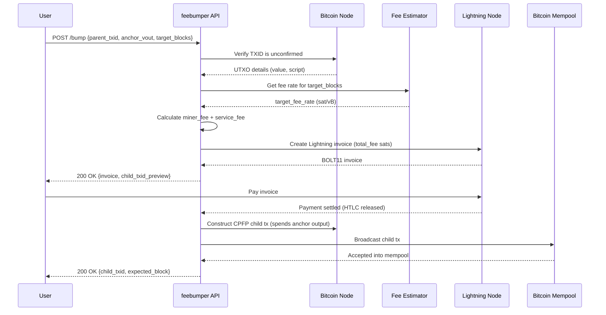

# feebumper

A transaction anchor fee-bumping service, payable via Lightning Network.

> [!WARNING]
> **Work in progress.** This project is in active development and is not yet production-ready. APIs, config formats, and behaviour may change without notice. Do not use with real funds.

---

## 1. Overview

### What is this project?

`feebumper` is a service that accepts a stuck Bitcoin transaction — one that has stalled in the mempool due to insufficient fees — and bumps its effective fee rate using **Child-Pays-For-Parent (CPFP)** via the transaction's **anchor output**. The service charges for this work over the Lightning Network.

### What problem does it solve?

Bitcoin's mempool is a competitive fee market. Transactions broadcast during periods of low fees can become stranded when network congestion rises, leaving funds unconfirmed for hours or days. While Replace-By-Fee (RBF) is one solution, it requires the original broadcaster to sign a new transaction. **CPFP via anchor outputs** offers an alternative: any party holding the anchor output's key can create a child transaction that incentivizes miners to include the stuck parent.

This service acts as a **CPFP-as-a-service** provider, performing the bump on the user's behalf in exchange for a Lightning payment.

### Why build this with Anchor Outputs and LN?

**Anchor outputs** (standardized in [BOLT #3](https://github.com/lightning/bolts/blob/master/03-transactions.md) and available more broadly via the `SIGHASH_SINGLE | SIGHASH_ANYONECANPAY` pattern) are small, pre-committed outputs on a transaction specifically designed to allow a third party to attach a child transaction for fee bumping. They remove the need for the original signer to re-sign anything.

**Lightning Network payments** are the natural payment rail here because:
- Payments settle instantly, enabling the service to act immediately without waiting for on-chain confirmation of the fee.
- They are trust-minimized: the service can require payment before broadcasting or use a hodl-invoice to atomically link payment release to the CPFP broadcast.
- The users most likely to need fee bumping (e.g., Lightning node operators dealing with time-sensitive commitment transactions) already have LN infrastructure.

### What is the benefit to the user?

- **No re-signing required.** The user does not need to produce a new signed transaction.
- **Speed.** A Lightning payment takes seconds; the CPFP child can be broadcast immediately after.
- **Convenience.** Outsource the complexity of fee estimation, UTXO management, and transaction construction to the service.
- **Time-critical rescue.** Especially useful for Lightning commitment transactions that have a CSV lock — every block counts.

---

## 2. Architecture & Flow

### End-to-End Sequence




## 3. How It Works

### How does a typical transaction become "anchor-bumpable" via this service?

A transaction is eligible for CPFP bumping through this service if it meets one of the following:

1. **It contains an anchor output** — a small (typically 330–546 sat) output with a script that the service can spend, such as a `p2wpkh` or a `p2wsh` script with `OP_1 OP_CHECKSEQUENCEVERIFY` (after 1 block).
2. **It is unconfirmed and below the current mempool minimum fee rate**, causing it to be effectively stuck.

The service does not need to see the user's private keys or have any signing authority over the original transaction.

### What are the technical steps of the fee bump?

1. **User submits** the stuck transaction's TXID and the index of the anchor output to the service.
2. **Service validates** that the TXID is unconfirmed and that the anchor output is spendable (either directly by the service's key, or via a 1-block CSV).
3. **Service calculates** the target fee rate to accelerate confirmation to the user's desired block target, accounting for the parent's size and current fee.
4. **Service generates a Lightning invoice** for the bump fee (service fee + on-chain miner fee).
5. **User pays the invoice** over Lightning.
6. **Service constructs and broadcasts** the CPFP child transaction, spending the anchor output and attaching enough fee to bring the package (parent + child) to the target fee rate.
7. **User receives confirmation** (TXID of child, expected confirmation block estimate).

### What data does the service need from the user?

| Field | Description |
|---|---|
| `parent_txid` | TXID of the stuck transaction |
| `anchor_vout` | Output index of the anchor output |
| `target_blocks` | Desired confirmation target in blocks (e.g., `1`, `3`, `6`) |
| `contact` (optional) | Lightning node pubkey or email for status updates |

The user does **not** need to provide private keys, raw transaction hex, or wallet credentials.

### How is the bump fee calculated?

The total fee the service charges is:

```
total_fee = miner_fee + service_fee
```

Where:

- **`miner_fee`** is computed by estimating the fee rate needed to confirm within `target_blocks` blocks (sourced from a fee estimator such as `estimatesmartfee` or a mempool API), then calculating:

  ```
  miner_fee = target_fee_rate * (parent_vsize + child_vsize) - parent_existing_fee
  ```

  The child transaction must contribute enough fee to bring the entire package up to the target rate.

- **`service_fee`** is a flat or percentage fee for operating the service (UTXO management, Lightning node operation, API costs).

The user is presented with the total Lightning invoice amount before paying. No funds are taken until the invoice is settled.

---

## 3. Setup

### Prerequisites

- Rust (edition 2024) — install via [rustup](https://rustup.rs)
- A Bitcoin full node (e.g., Bitcoin Core) with RPC access
- A Lightning Network node (e.g., LND, CLN, or LDK-based) with an active channel
- Sufficient on-chain funds in the service wallet to construct CPFP transactions

### Installation

```bash
git clone https://github.com/iamthesvn/feebumper
cd feebumper
cargo build --release
```

The compiled binary will be at `target/release/feebumper`.

### Configuration

Create a `config.toml` in the project root (or set the path via `--config`):

```toml
[bitcoin]
rpc_url    = "http://127.0.0.1:8332"
rpc_user   = "user"
rpc_pass   = "pass"
network    = "mainnet"   # or "testnet", "signet", "regtest"

[lightning]
node_url   = "https://127.0.0.1:8080"
macaroon   = "/path/to/admin.macaroon"
tls_cert   = "/path/to/tls.cert"

[service]
service_fee_sats  = 1000       # flat service fee per bump
min_target_blocks = 1
max_target_blocks = 144
listen_addr       = "0.0.0.0:3000"
```

### Running the service

> [!NOTE]
> The service is not yet functional. The binary currently builds but does nothing beyond a placeholder. This section documents the intended interface and will be updated as implementation progresses.

```bash
./target/release/feebumper --config config.toml
```

Once implemented, the service will expose an HTTP API on the configured `listen_addr`. API documentation is coming alongside the implementation.

---

## 4. Caveats

### Security disclaimer

> **This software is experimental and unaudited. Use at your own risk.**

- The service holds on-chain Bitcoin UTXOs to construct CPFP transactions. Compromise of the service wallet results in loss of those funds.
- The service's Lightning node holds channel liquidity. Secure your node's macaroon and TLS credentials.
- No cryptographic binding currently exists between the Lightning payment and the CPFP broadcast (hodl-invoice atomicity is a planned feature). In the current design, payment is taken before the child transaction is broadcast; a crash between these two steps could result in a paid-but-unbroadcast bump.
- Always verify the invoice amount before paying. The service does not have access to any funds beyond what you explicitly send via Lightning.

### Limitations

- **Anchor output ownership**: The service can only bump transactions where the anchor output is spendable by the service's key, or where it uses a standard 1-block CSV script that becomes anyone-can-spend after one confirmation. Proprietary or non-standard anchor scripts are not supported.
- **Mempool policy**: CPFP package relay requires the parent to be in the mempool. Transactions that have been evicted (dropped) from the mempool cannot be rescued without re-broadcasting the parent first.
- **Package size limits**: Bitcoin Core enforces package size limits (25 transactions, 101 kvB). Very large ancestor chains may block the CPFP from being accepted.
- **No RBF on child**: The child transaction is broadcast as-is. If the fee estimate is wrong, a second bump may be needed.
- **Testnet only for now**: Mainnet deployment requires additional operational hardening not yet implemented.
